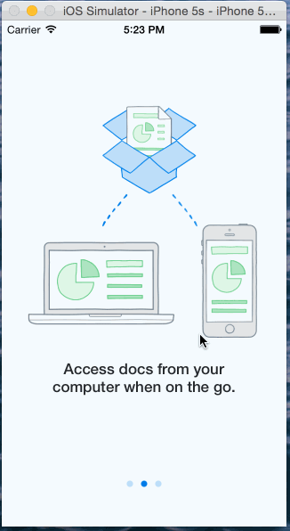

# Dropbox
This is a prototype of the Dropbox for iOS App. It allows you to swipe through the introduction, sign or (or create an account)
and view your files/folders in a Tab View. You can also log out from either being signed in or having created a new account.

Hours spent: 8-10

Completed Tasks:
* [x] User can tap through the 3 welcome screens.
• [x] User can follow the create user flow.
* [x] On the create user form, the user can tap the back button to go to the page where they can sign in or create an account.
* [x] Before creating the account, user can choose to read the terms of service.
* [x] After creating the account, user can view the placeholders for Files, Photos, and Favorites as well as the Settings screen.
* [x] User can log out from the Settings screen.
* [x] User can follow the sign in flow.
* [x] User can tap the area for "Having trouble signing in?"
* [x] User can log out from the Settings screen.
* [x] Optional: You should be able to swipe through the welcome screens instead of just tapping them.

© Copyright 2015, Kyle DeHovitz

